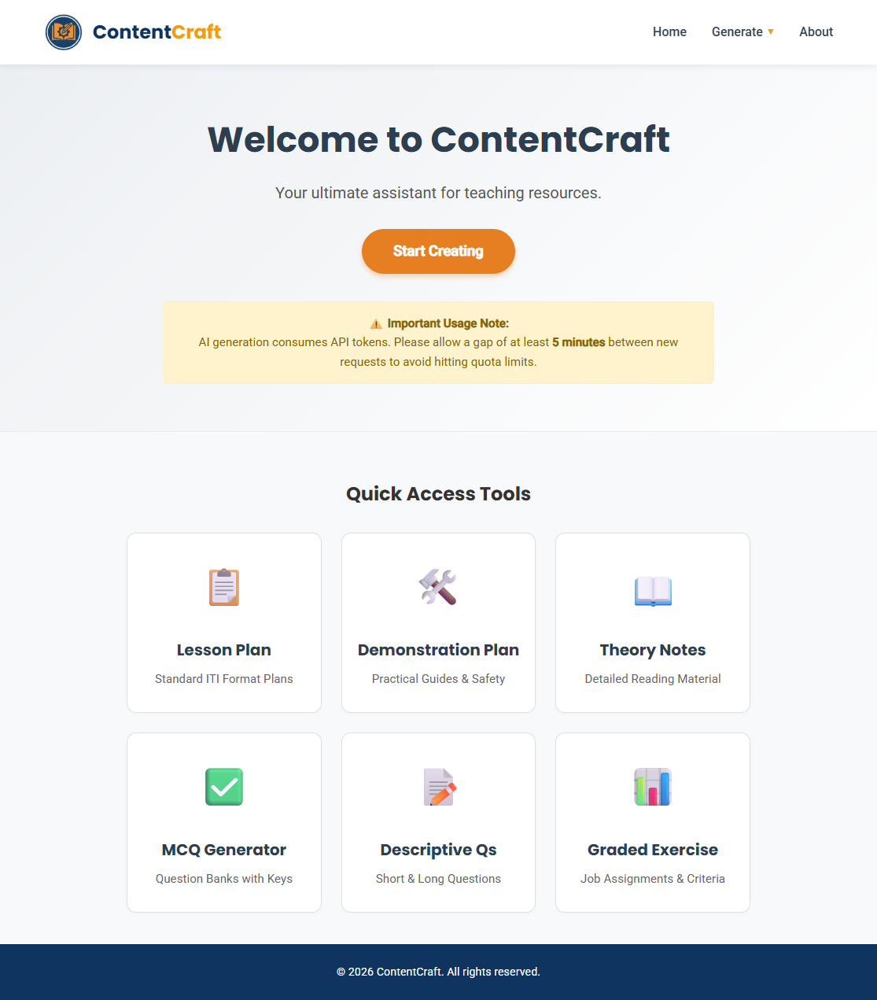

# 🚀 ContentCraft

### AI-Powered Teaching Assistant for Educators


---

## ✨ What is ContentCraft?

ContentCraft is an AI-powered web application that helps instructors generate structured academic content in seconds.

Instead of manually preparing documentation for hours, educators can instantly generate:

* 📝 Lesson Plans
* 🧪 Demonstration Plans
* 📘 Theory Notes
* ❓ MCQ Question Banks
* ✍️ Short & Long Answer Questions
* 📊 Graded Exercises

Built especially for ITI trainers and vocational instructors — but useful for any educator.

---

## 🎯 Why This Project Exists

Academic documentation is repetitive and time-consuming.

ContentCraft automates that process using AI while keeping the content structured, readable, and editable.

You focus on teaching.
Let AI assist with preparation.

---

## Screenshots

| Home |
| --- |
| 


| Example Lesson plan |  |
| --- | --- |
|  |  |
|  |  |
|  |  |


---

## 🌍 Multi-Language Support

* English
* Hindi
* Gujarati

Designed for real classroom environments in India.

---

## 🎨 Typography & Design

To ensure professional readability and accurate rendering of multi-language technical terms, **ContentCraft** utilizes specialized typography:

* **English Content:** Uses standard system fonts like **Segoe UI**, **Roboto**, and **Arial**.
* **Gujarati & Hindi Content:** Optimized for **Noto Serif Gujarati** and **Noto Serif Devanagari**.
* **Export Compatibility:** These fonts are integrated into our export logic for PDF and DOCX files.

> [!TIP]
> **Better Results:** For the best experience while viewing or editing exported documents, you may be required to install the **Noto Serif** font family on your local system. You can download them for free from [Google Fonts](https://fonts.google.com/) here.

---

## 🏷️ Tech Stack

* PHP
* JavaScript
* AJAX
* HTML5
* CSS3
* Google Gemini API

Runs locally using XAMPP (Apache server).

---

# 📦 Easy Setup (ZIP Method – Beginner Friendly)

No advanced technical knowledge required.

---

## Step 1 – Download the Project

1. Click the green **Code** button.
2. Select **Download ZIP**.
3. Extract the ZIP file.

---

## Step 2 – Install XAMPP

Download from:
[https://www.apachefriends.org/](https://www.apachefriends.org/)

Install normally.

---

## Step 3 – Move Project Folder

1. Open your XAMPP folder.
2. Open the `htdocs` folder.
3. Paste the extracted **ContentCraft** folder inside.

Example path:

```
C:\xampp\htdocs\ContentCraft
```

---

## Step 4 – Start Apache

1. Open XAMPP Control Panel.
2. Click **Start** next to Apache.

(No database required for basic usage.)

---

## Step 5 – Add Your Gemini API Key

1. Open the project folder.
2. Locate the PHP file where the API key is defined.
3. Replace:

```php
define('GEMINI_API_KEY', 'YOUR_API_KEY_HERE');
```

with your real API key.

Get a free API key from:
[https://ai.google.dev/](https://ai.google.dev/)

---

## Step 6 – Run the Application

Open your browser and visit:

```
http://localhost/ContentCraft/
```

You're ready to generate content ✅

---

# 🧠 How It Works

1. Select content type.
2. Enter topic and required details.
3. The system sends a request to Google Gemini AI.
4. AI generates structured academic content.
5. You can review, edit, or export it.

---

# ⚠️ Important Note

AI-generated content must always be reviewed before official academic submission.

ContentCraft is an assistant — not a replacement for professional judgment.

---

# 🚀 Roadmap

Upcoming improvements:

* User login & dashboard
* Save generated content history
* Cloud deployment
* Improved UI/UX
* Better export formatting
* Prompt customization
* Dark mode
* Performance optimization

---

# 🤝 Contributing

We welcome contributors of all levels.

You can help by:

* Improving UI/UX
* Enhancing AI prompts
* Optimizing backend logic
* Improving formatting
* Adding new language support
* Fixing bugs
* Improving documentation

### To Contribute:

1. Fork the repository
2. Create a new branch
3. Make your improvements
4. Submit a Pull Request

Please read `CONTRIBUTING.md` before submitting.

---

# 🌟 Support the Project

If this project helps you:

⭐ Star the repository
🍴 Fork it
📢 Share it with educators
🛠️ Contribute improvements

---

# 👨‍💻 Author

**Keshav Shiyal**

AI + Education + Automation Enthusiast

GitHub:
[https://github.com/keshavshiyal](https://github.com/keshavshiyal)

---
